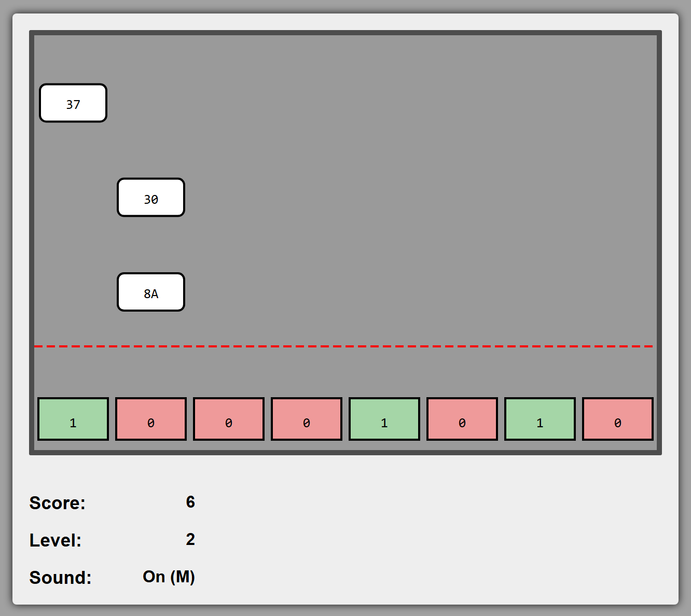

# Flippy Bit

[English](README.md) | 日本語

[](https://github.com/Haruto03/flippy-bit/actions/workflows/deploy.yml)

**[ブラウザでプレイする →](https://haruto03.github.io/flippy-bit/)**

TypeScript と RxJS で書いた、純粋関数型リアクティブスタイルのブラウザゲームです。
画面の上から 16 進数のターゲットが落ちてきます。一番下にある 8 桁の 2 進数の行のビットを
反転させ、最下点のターゲットがデッドラインに触れる前に同じ値を作ってください。

制作: Haruto Iriyama



<sub>ビット列は <code>1000 1010</code>、最下点のターゲット <code>8A</code> と一致した状態です。</sub>

## 遊び方

| 入力 | 動作 |
|---|---|
| `1` – `8` | 対応するビットを反転(左端が最上位ビット) |
| 数字ボックスをクリック | そのビットを反転 |
| `P` | 一時停止 / 再開 |
| `R` | リスタート(プレイ中・ゲームオーバー後のどちらでも) |
| `M` | 効果音のオン / オフ |

クリックまたは Enter キーでスタートします。ターゲットはランダムな列に出現し、
下端がデッドラインに触れた瞬間に判定されます。値が一致していれば加点してターゲットが消え、
外れていればゲームオーバーです。5 点ごとにレベルが上がり、レベルが上がるほど、
また生き延びるほどターゲットの落下が速くなります。

## ローカルでの実行

Node.js が必要です。

```bash
npm install
npm run dev      # ローカルサーバーを起動(コンソールの URL を Ctrl+クリック)
npm test         # vitest
npm run build    # 型チェックとバンドル
```

`main` への push ごとにテストが実行され、ビルド結果が GitHub Pages に
デプロイされます([`.github/workflows/deploy.yml`](.github/workflows/deploy.yml))。

## 設計

ゲーム全体が [`src/main.ts`](src/main.ts) に収まっており、RxJS の上に
Model–View–Update アーキテクチャを構築しています。

- **状態はイミュータブル。** `State` と `Target` は `Readonly` 型で、更新のたびに
  スプレッド構文で新しいオブジェクトを生成します。
- **すべての入力を `Action` として表現。** 20 ms のクロック(`Tick`)、キーボードと
  マウスによるビット反転(`FlipBit`)、`Pause`、`Restart` はすべて
  `apply(s: State): State` を持つ単一のインターフェースを実装します。キーボードと
  マウスは*同じ* `FlipBit` アクションを生成するため、モデル側は入力手段を区別しません。
- **1 つの畳み込みがすべてを駆動。** 入力の Observable を `merge` して単一の
  アクションストリームにまとめ、`scan(reduceState, initialState)` で畳み込みます。
  アクションは逐次適用されるので並行更新が起こらず、新しい入力手段を追加しても
  reducer には手を入れません。
- **乱数も純粋。** ターゲットの値・出現する列・出現間隔は、シードを状態に持つ
  線形合同法生成器から得ます。これにより `tick` は純粋関数のままで、1 つのシードから
  プレイ全体を再現できます。
- **導出値は保持しない。** ビット列の数値、レベル、現在の落下速度は必要な場所で
  状態から計算します。そのため状態と食い違うことがありません。
- **副作用は View に閉じ込める。** DOM に触れるのは `render` だけで、状態を SVG に
  射影するだけの関数です。効果音は連続する状態に対する純粋な
  `soundEvents(prev, next)`(`pairwise`)から決まり、Web Audio の合成音として
  再生します(音声ファイルは不要)。画面外に出たターゲットは `exit` リストで
  View に伝え、要素を削除します。
- **ストリームは決して完了しない。** ゲームオーバーや一時停止のときは購読を解除せず、
  `Tick` が状態を据え置きます。これによりリスタートや再開を特別扱いせず、
  通常のアクションとして実装できます。

## ディレクトリ構成

```
src/main.ts        ゲームロジック、アクション、入力ストリーム、描画
src/style.css      スタイルシート
index.html         SVG キャンバスの雛形
test/main.test.ts  vitest のテスト
```

ビルド設定と SVG の雛形はスターターテンプレート由来です。ゲームロジック、アクション、
入力処理、描画はすべて自作です。
